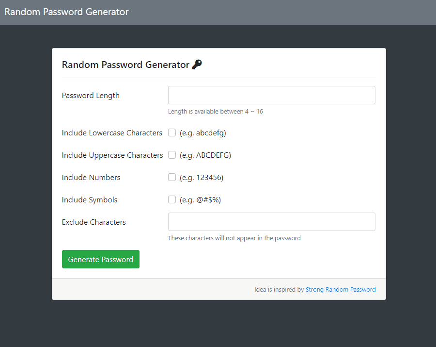

# Password Generator
[](https://standardjs.com)

## Motivation

When register a website or a channel, it is a frustration to think of an appropriate password, 
so I build a tiny project to create a valid password to help out.

## Features

Check the option and type the character you do not want to show in your password.



## Prerequisites

1. Node.js (v14.16.0 recommanded)
2. GitBash or Cmder(Windows) / Terminal (Mac)

## Installation 

1. Open your terminal, then clone the repo to your local.
```
git clone https://github.com/lcy101u/password_generator.git
```
2. Move to repo directory.
```
cd password_generator
```
3. Install dependencies.
```
npm install
```

## Execution
1. Start Express server in Node.js
```
npm run start
```
OR Start Express server in dev mode (By Nodemon)
```
npm run dev
```
2. Connect to http://localhost:3000
3. To quit from server
```
ctrl + c
```

### Dev tools

- Node.js (14.16.0)
- Express (4.17.1)
- Express-handlebars (5.3.4)
- Bootstrap (4.6)
- font-awesome (5.8.1)

### Contributor

[Young](https://github.com/lcy101u)

